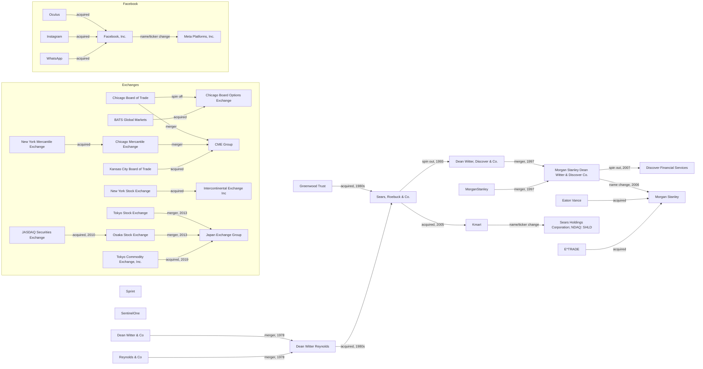

# web-of-finance

```mermaid
graph LR;
DFS[Discover Financial Services]
DWD[Dean Witter, Discover & Co.]
DWR[Dean Witter Reynolds]
ETFC[E*TRADE]
EV[Eaton Vance]
FB[Facebook, Inc.]
META[Meta Platforms, Inc.]
MS[Morgan Stanley]
S[Sears, Roebuck & Co.]
S*[Sprint]
S**[SentinelOne]
SHLD[Sears Holdings Corporation; NDAQ: SHLD]

GreenwoodTrust[Greenwood Trust]
DeanWitter[Dean Witter & Co]
Reynolds[Reynolds & Co]
MorganStanley[MorganStanley]
MorganStanleyDeanWitterDiscover[Morgan Stanley Dean Witter & Discover Co.]
KMart[Kmart]
WhatsApp[WhatsApp]
Instagram[Instagram]
Oculus[Oculus]
CBOT[Chicago Board of Trade]
CBOE[Chicago Board Options Exchange]
CME[CME Group]
ChicagoMercantileExchange[Chicago Mercantile Exchange]
NYMEX[New York Mercantile Exchange]
ICE[Intercontinental Exchange Inc]
NYSE[New York Stock Exchange]
BATS[BATS Global Markets]
KCBT[Kansas City Board of Trade]
JASDAQExchange[JASDAQ Securities Exchange]
TSE[Tokyo Stock Exchange]
OSE[Osaka Stock Exchange]
JPX[Japan Exchange Group]
TOCOM[Tokyo Commodity Exchange, Inc.]


subgraph "Exchanges"
  direction LR
  CBOT -- spin off --> CBOE
  BATS -- acquired --> CBOE
  CBOT -- merger --> CME
  ChicagoMercantileExchange -- merger --> CME
  NYMEX -- acquired --> ChicagoMercantileExchange
  NYSE -- acquired --> ICE
  KCBT -- acquired --> CME

  JASDAQExchange -- acquired, 2010 --> OSE
  TSE -- merger, 2013 --> JPX
  OSE -- merger, 2013 --> JPX
  TOCOM -- acquired, 2019 --> JPX
end

DeanWitter -- merger, 1978 --> DWR
Reynolds -- merger, 1978 --> DWR
GreenwoodTrust -- acquired, 1980s --> S
DWR -- acquired, 1980s --> S
S -- spin out, 1993 --> DWD
S -- acquired, 2005 --> KMart
KMart -- name/ticker change --> SHLD
DWD -- merger, 1997 --> MorganStanleyDeanWitterDiscover
MorganStanley -- merger, 1997 --> MorganStanleyDeanWitterDiscover
MorganStanleyDeanWitterDiscover -- spin out, 2007 --> DFS
MorganStanleyDeanWitterDiscover -- name change, 2006 --> MS
EV -- acquired --> MS
ETFC -- acquired -->MS

subgraph "Facebook"
  direction LR
  Oculus-- acquired --> FB
  Instagram-- acquired --> FB
  WhatsApp-- acquired --> FB
  FB -- name/ticker change --> META
end
```
